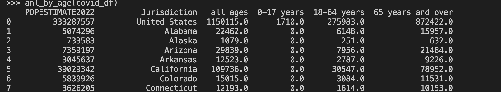

Thank you and welcoome to health map!

How to run the program:

1st Way:

 1- open a terminal

 2- cd to the directory that the files are stored

 3- execute run.sh

        $ sh run.sh (do not include $)
        if this doesnt run fir execute this command then do sh run.sh
            chmod u+x run.sh
2nd way:

    Befor running GUI.py run DataFrames.py first!
    python3 DataFrames.py
    pthon3 GUI.py
How to navigate:

1- on the left panels user can choose witch particular disease they would like to display on map 

2- as well as chooosing the year

    Note: After choosing a specific year, if you wish to revert back to total death, simply unckeck the check 
    button, and click on that disease (or any other disease) radio button. 

3- map polygons are clickble and user can display monthly analysis for the state of intrest at just by clicking on the state polygon

4- after choosing specific disease user is able to display Age death rate by state analysis by clicking on Age Analysis button in left panel

    this will display heat map and table in a new window

5- a map legend bar on the right side of map displays the total death color scale as well as time period the data are being displayes 

Screen shot of some data frames:

map polygon dictionary

{'Alabama': [2], 'Arizona': [3], 'Arkansas': [4], 'California': [5], 'Colorado': [6], 'Connecticut': [7], 'Delaware': [8], 'Florida': [9], 'Georgia': [10], 'Idaho': [11], 'Illinois': [12], 'Indiana': [13], 'Iowa': [14], 'Kansas': [15], 'Kentucky': [16], 'Louisiana': [17], 'Maine': [18], 'Maryland': [[20]], 'Massachusetts': [21], 'Michigan': [[25]], 'Minnesota': [26], 'Mississippi': [27], 'Missouri': [28], 'Montana': [29], 'Nebraska': [30], 'Nevada': [31], 'New Hampshire': [32], 'New Jersey': [33], 'New Mexico': [34], 'New York': [35], 'North Carolina': [36], 'North Dakota': [37], 'Ohio': [38], 'Oklahoma': [39], 'Oregon': [40], 'Pennsylvania': [41], 'Rhode Island': [[43]], 'South Carolina': [44], 'South Dakota': [45], 'Tennessee': [46], 'Texas': [47], 'Utah': [48], 'Vermont': [49], 'Virginia': [[52]], 'Washington': [[55]], 'West Virginia': [56], 'Wisconsin': [57], 'Wyoming': [58]}
    the numbers are refrence and not name necessurily 

at the end of the day im going to use corntab to schedule updating our data.csv-->desease file because the data gets updated evry 2 weeks command
~ corntab -e <frequency> curl -o data.csv https://path/to/file.csv

Errors
  